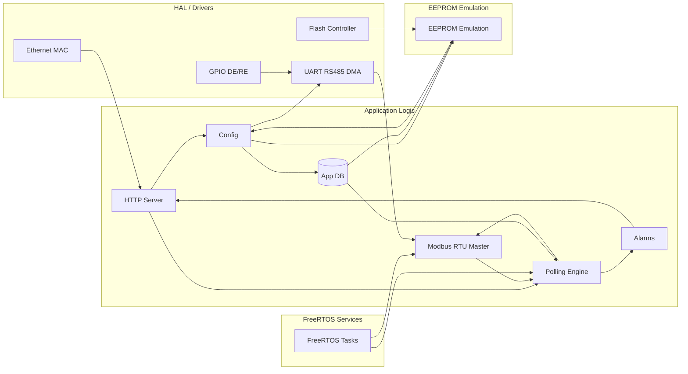

**Architecture logicielle détaillée — Plateforme Modbus RTU + Web**

Résumé
- Cible: STM32F429ZI
- Objectif: Maître Modbus RTU (RS485) + interface web pour configuration/supervision
- Principes: séparation en couches (HAL → Middleware → Services RTOS → Modules applicatifs → UI), persistance Flash via émulation EEPROM, communications via LwIP, ordonnancement via FreeRTOS

1. Vue d'ensemble des composants

- Hardware / HAL
  - Pilotes STM32 HAL: UART, DMA, GPIO, FLASH
  - Fichiers liés: Drivers/STM32F4xx_HAL_Driver

- Middleware
  - FreeRTOS: tâches, queues, mutexes, timers
  - LwIP: pile TCP/IP (netconn API)

- Services système
  - HTTP server (netconn example)
  - EEPROM emulation (EE library)

- Modules applicatifs
  - HTTP (UI) — pages et handlers
  - CONFIG — gestion réseau et app DB
  - MODBUS — maître RTU, CRC, état
  - POLLING — ordonnancement des lectures Modbus
  - ALARM — surveillance des seuils, historiques
  - PERSISTENCE — lecture/écriture Flash

2. Emplacement des fichiers principaux

- HTTP / server: Core/Src/httpserver-netconn.c
- HTTP handlers: Core/Src/network_config_http.c, Core/Src/app_config_http.c
- Modbus master: Core/Src/modbus_rtu_master.c
- RS485 / UART interface: Core/Src/rs485_interface.c
- Polling engine: Core/Src/polling_engine.c
- App config / DB: Core/Inc/app_config.h, Core/Src/app_config.c
- Persistence / EE: Core/Src/persistent_store.c, Core/Src/ee.c
- Network config: Core/Inc/network_config.h, Core/Src/network_config.c

3. Structures de données critiques

- `network_config_t` (magic, ip[4], netmask[4], gateway[4]) — runtime: `g_network_config`
- `appDataBase_t` / `appDb` — contient `ports[]`, `slaveConfig[]`, chaque `slaveConfig` contient `registerConfig[]` (used, regAddress, registerType, lastValue, valid, alarmEnabled, alarmThreshold, alarmActive)
- Buffers Modbus: `modbusMasterRequest[]`, `modbusMasterResponse[]`, état `modbusMasterStatus`

4. Séquences importantes

- Configuration réseau via UI
  1. POST `/save_config` reçu par `httpserver-netconn`
  2. `network_config_http_handle_save()` parse et valide (parse_ipv4)
  3. `network_config_save()` -> `persistent_store_save_network()` -> `ee_write()`
  4. Réponse HTTP 200 / reboot optionnel

- Lecture Modbus (Polling)
  1. `Polling task` lit `appDb` et déclenche `modbusMaster_readHoldingRegister()`
  2. `rs485_interface_send()` active DE, transmet, remet RX
  3. `rs485_interface_receive(... DMA)` attend réponse
  4. `HAL_UART_RxCpltCallback()` appelle `modbusMaster_cpltCallBack()`
  5. CRC vérifié, `lastValue` mis à jour, alarmes évaluées

5. Concurrence et synchronisation

- Utiliser un mutex FreeRTOS pour protéger `appDb` et `g_network_config` lors d'accès concurrents (HTTP handlers, polling task, API). Exemple: `xSemaphoreCreateMutex()`.
- Communication inter-tâches: utiliser queues/notifications pour événements (CONFIG_UPDATED, SAVE_REQ).

6. Persistance Flash — contraintes et recommandations

- `ee_init(data, size)`, `ee_read()`, `ee_write()` effectuent lecture/écriture de la zone Flash réservée.
- Éviter écritures fréquentes: implémenter write-coalescing (ex: délai 2s après dernière modification avant `ee_write()`).
- Vérifier adresse Flash réservée (ne pas empiéter sur `.text`/bootloader).

7. Points de vigilance détectés

- Correction nécessaire: faute de variable dans `ee.c` (doubleWord vs double_word) — empêcherait la compilation.
- Assurer contrôle DE/RE correct et waiting TX complete avant retour RX.
- Gérer timeouts/retries Modbus pour robustesse.

8. Sécurité

- Par défaut, pas d'authentification HTTP; ajouter si exposition réseau réelle.
- Valider strictement toutes entrées form (déjà présent pour IP). Ajouter limites de longueur et protections contre body trop gros.

9. Tests recommandés

- Unit tests: parsing IP, netmask validation, CRC Modbus.
- Intégration: simulateur esclave Modbus (docs/modbus_slave_simulator.py) pour tests E2E.
- Tests Flash: vérifier latences et endurance.

10. Diagramme Mermaid (architecture simplifiée)

-- Fin --
